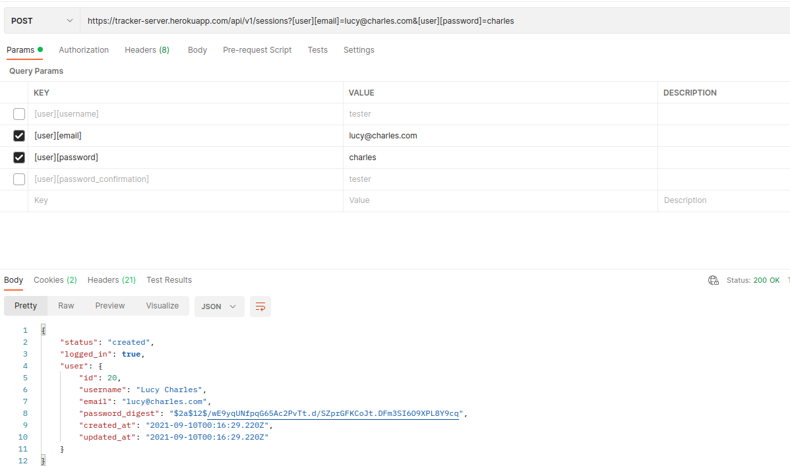
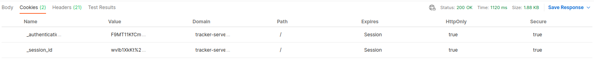
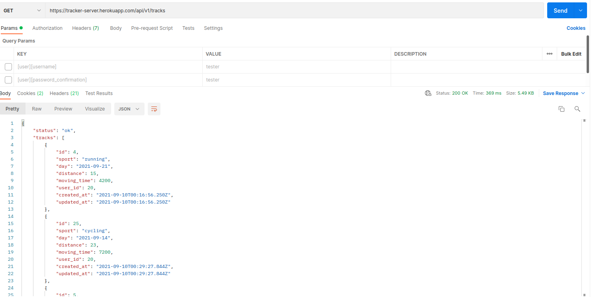

# Tri Tracker - REST API

Backend service for the [Tri Tracker App](https://github.com/thneves/tri-tracker-client). 

## About

This is a API only Rails application. A REST API that only returns JSON responses,
here is made the creation and authentication of users and their tracks. We use `Rails Sessions` and `Cookies`
to keep users logged in. `Postgresql` is used as database, where we store users and their data. Deployed on `Heroku`. 

## Built With

- [Ruby](https://www.ruby-lang.org/en/)
- [Ruby on Rails 6](https://rubyonrails.org/)
- [PostgreSQL](https://www.postgresql.org/)
- [RSpec](https://rspec.info/)
- [Heroku](https://heroku.com)

## Endpoints

The base URL for all endpoints is `https://tracker-server.herokuapp.com/api/v1`

Summary of available api endpoints:

POST `/registration` for authenticating new users, saves user in db, creates a new session and log in this user.
POST `/sessions` makes the login for a existing user creating a new session.
POST `/tracks` create a new activity of the current user in session and save it in db.
GET `/tracks` checks the current user, and retrieve all his activities, used to check detailed info of activities and also for checking progress.
DELETE `/logout` reset the current session, and log out the current user.

example of a POST request of a new session on POSTMAN:



New session id of same request:




example of GET request of the same session user above:




## 💻 Getting Started

To get a local copy up and running follow these simple example steps.

### Prerequisites

Install [Ruby](https://www.ruby-lang.org/en/documentation/installation/)

Install [Rails 6](https://guides.rubyonrails.org/getting_started.html)

Install [Postgres: >=9.5](https://www.postgresql.org/download/)

### Setup

Open the terminal inside a folder of your choice and clone this repository using the following [Git](https://git-scm.com/downloads) commands in the terminal:

```
    git clone https://github.com/thneves/triathlon-tracker.git
```

Then, enter the project folder using:

```
    cd triathlon-tracker
```

Change for the local mode branch:

```
    git checkout dev-local
```

Now install gems with:

```
bundle install
```

Setup database with:

```
   rails db:create
   rails db:migrate
```

<br>
<br>

### Usage

Start the server on <strong>`PORT 3001`</strong>:

```
    rails s -p 3001
```

Open `http://localhost:3001/` in your browser.

<br>
<br>

### Using the Front End

After you have the project running on `localhost:3001`, if everything is fine you should see a "it's working message"

go to this [PROJECT](https://github.com/thneves/tri-tracker-client) and follow the instructions.

Then you can enjoy both front and back end on your local machine.

<br>
<br>

### Running tests

```
    bundle exec rspec
```
